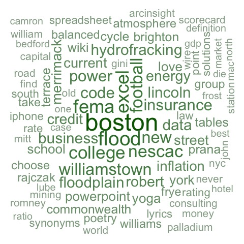
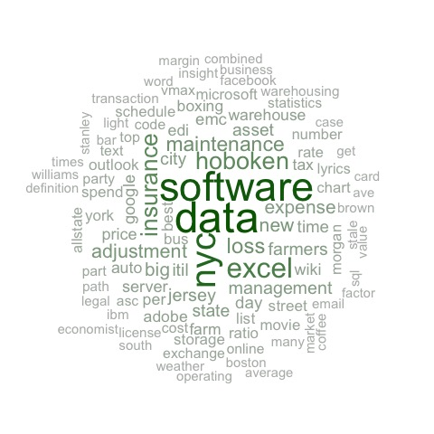
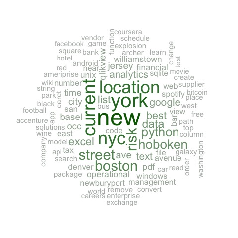
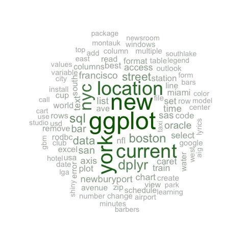
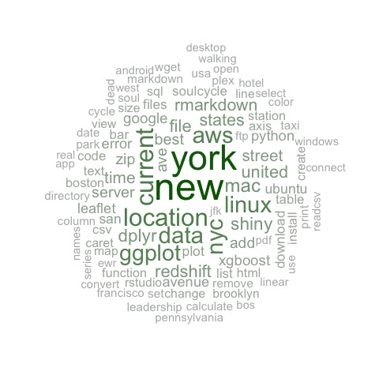
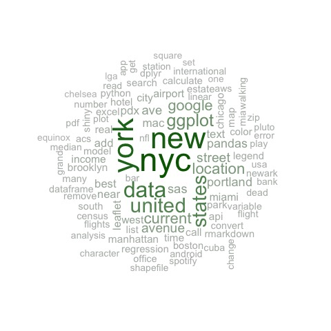

<link rel="stylesheet" href="styles.css">
<div id="bg"></img></div>

```{r set-options, echo=FALSE, cache=FALSE}
options(width = 100)
```

```{r setup, echo = FALSE,message = FALSE, warning = FALSE, include=F}

master.plot.list <- readRDS(file = "google-search-master-plot.rds")

```

## {.tabset .tabset-fade .tabset-pills}


### What is this?

<div class="col-lg-4">

I downloaded and analyzed my entire available Google Search history. My Google history contains 39,040 searches since February 2nd, 2011 (spread across 24 JSON files). As we can see from the graph on the right, late 2015 was a busy time for me!

For instructions on downloading your own history, see https://support.google.com/accounts/answer/3024190?hl=en

</div>

<div class="col-lg-8">

```{r, echo=FALSE, message=FALSE, warning=FALSE}
master.plot.list[["GoogleSearchHistogram"]]
```

</div>

<div class="col-lg-12">

#### Once parsed, search history data looks like this:


```{r, echo=FALSE, message=FALSE, warning=FALSE}

knitr::kable(master.plot.list[["SampleDat"]])

```

This was right at the end of college when I was trying to figure out what I wanted to do with my life. Go to law school? Become a patent lawyer? Ah, to be young again!


</div>


<div class="col-lg-12">

#### Going through this data was incredibly nostalgic! 

#### Click the next tab!

</div>


### What time of day am I most productive?

#### It appears that my most productive time of the day is between 2-3 pm. Note how my workday has slowly gotten later and later since 2011. Also note the slight bump in traffic around 6-7pm. I am definitely a night owl. 

```{r, echo=FALSE, message=FALSE, warning=FALSE, fig.align='center', fig.width = 10, fig.height = 8}
master.plot.list[["GoogleSearchHourly"]]
```

#### Wednesdays are particularly busy for me. 2015 and 2016 have been some of my busiest years to date.

```{r, echo=FALSE, message=FALSE, warning=FALSE, fig.align='center', fig.width = 10, fig.height = 8}
master.plot.list[["GoogleSearchWeekday"]]

```


### What is my busy time of year?


2015 saw a massive spike in search traffic late in the year. That was when I started my new job and was working hard to build out our proprietary database. That project worked out pretty well, but it also bruned me out. I can see this pattern in the data: large pushes to do big projects, followed by a decrease in productivity. Makes me wonder, could I monitor my search traffic as a proxy for my own health? 


```{r, echo=FALSE, message=FALSE, warning=FALSE}

master.plot.list[["GoogleSearchDensity"]]

```

It is also interesting to see how large spikes in activity are often followed by gradual declines lasting up to 6 months (look at 2015 and 2016). It seems like I have 2 big projects in me per year, then I wind down / burn out for a while.

```{r, echo=FALSE, message=FALSE, warning=FALSE}
master.plot.list[["GoogleSearchSeasonal"]]
```


### What time of year am I most productive?

#### My energy peaks in June. This chart also puts into context just how much of an outlier late 2015 was (the red dot in October). 

```{r, echo=FALSE, message=FALSE, warning=FALSE}
master.plot.list[["GoogleSearchBoxPlot"]]
```

### Word Bubbles By Year {.tabset .tabset-fade .tabset-pills}

click through the tabs...

#### 2011

In 2011, was living in Boston, working as a Strategy Consultant for energy companies, tracking Mitt Romney and doing yoga.

</img>

#### 2012

I spent much of 2012 as a product manager for an analytics product. I was living in Hoboken and just getting my feet wet in the data science world. 

</img>

#### 2013

In 2013 I got friendly with Python, moved into New York City and did operational risk management work for a financial services provider. 

</img>

#### 2014

I spent 2014 learning how to use R at production scale. I built my first professionally used predictive model and fell in love with ggplot2!

</img>

#### 2015

In 2015 I started working in real estate, opened an AWS account, fell in love with Linux nd RedShift and continued to master R. I also picked up a SoulCycle habbit.

</img>

#### 2016

2016 has been all about commercal real estate in New York City. One of the most common things I do now is search for new, novel data sources about a variety of topics, and have become better at the heavy-lifting data tasks like web scraping and parsing. 

</img>


